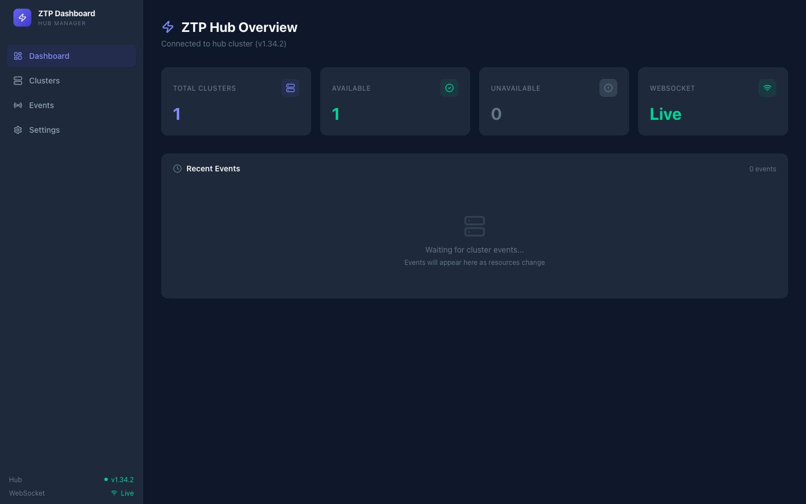
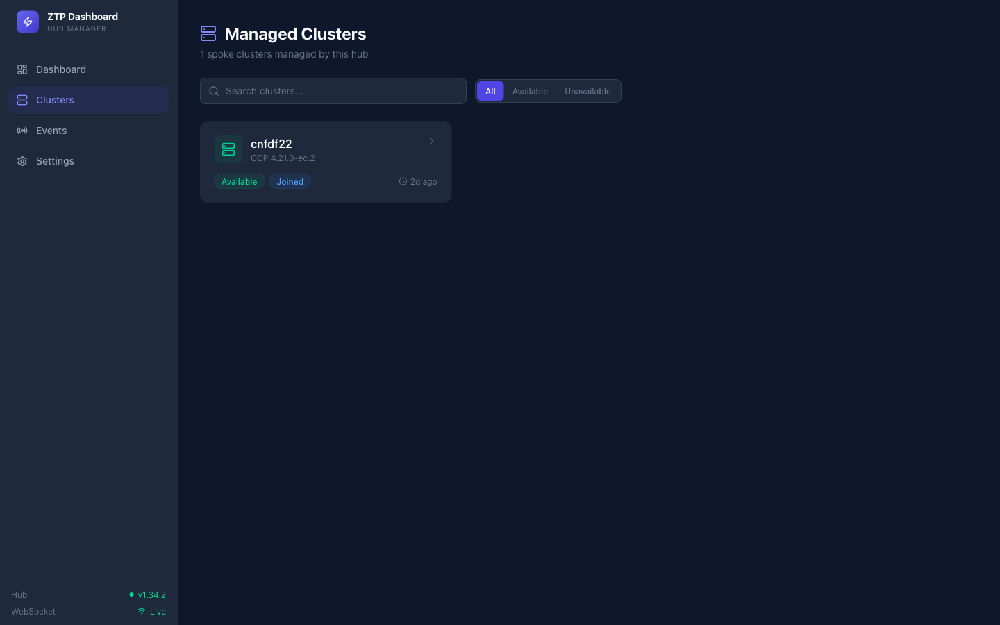
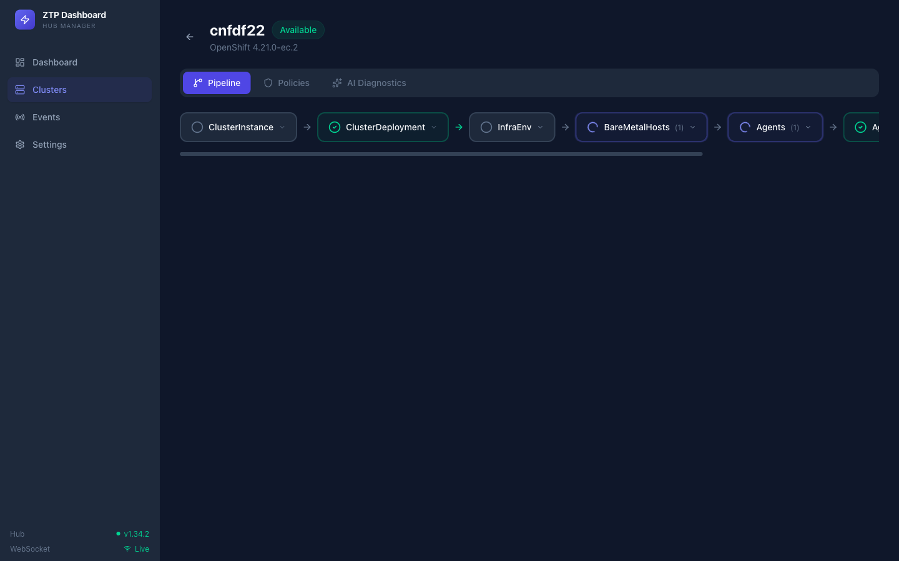
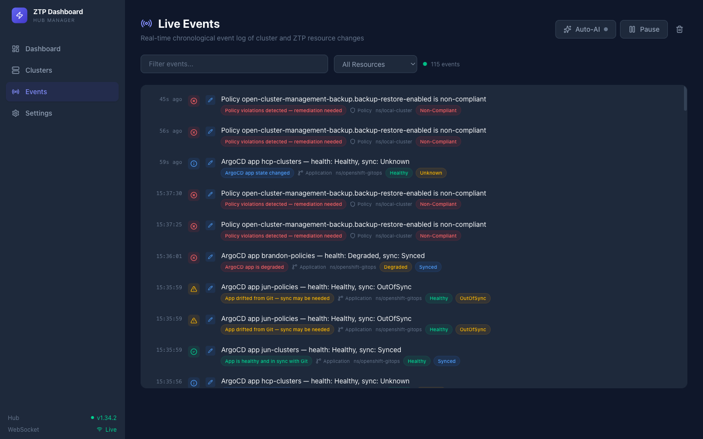
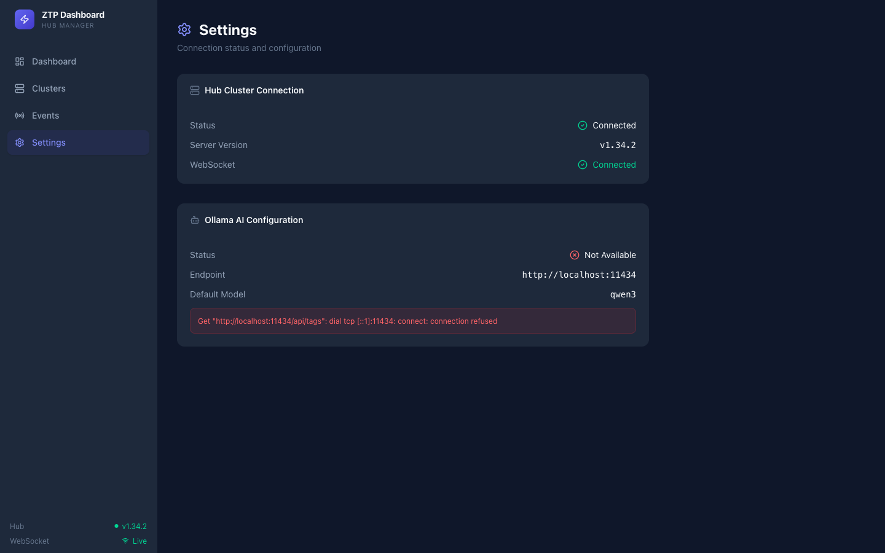

# ZTP Dashboard

A purpose-built dashboard for managing OpenShift Zero Touch Provisioning (ZTP) pipelines. Built as a single Go binary with an embedded React SPA, it provides real-time visibility into hub/spoke cluster provisioning, policy compliance, and AI-powered diagnostics via [ollama](https://ollama.com).



## Features

- **Real-time event stream** — WebSocket-driven live updates from 9 Kubernetes resource types (ManagedCluster, ClusterDeployment, ClusterInstance, InfraEnv, BareMetalHost, Agent, AgentClusterInstall, Policy, ArgoCD Application)
- **Pipeline visualization** — Visual provisioning pipeline showing each stage of the ZTP flow with color-coded status indicators
- **Event classification** — Server-side severity analysis (good/bad/warning/info) with contextual insights for every event
- **AI diagnostics** — Stream ollama-powered analysis of cluster issues with configurable model selection
- **Auto-AI mode** — Automatically analyze bad/warning events with ollama as they arrive
- **Policy compliance** — Track policy compliance status across managed clusters
- **Dark theme** — Custom dark UI with Tailwind CSS v4 design tokens

## Screenshots

### Managed Clusters
Browse all spoke clusters with status badges, OCP version, and quick filters.



### Pipeline View
Visual ZTP provisioning pipeline for each spoke cluster — ClusterInstance, ClusterDeployment, InfraEnv, BareMetalHosts, Agents, AgentClusterInstall, and ManagedCluster stages.



### Live Events
Real-time chronological event log with severity indicators, insight badges, resource type filters, and per-event AI analysis.



### Settings
Hub connection status, ollama AI configuration, and model selection.



## Quick Start

### Prerequisites

- Go 1.22+
- Node.js 20+
- Access to an OpenShift hub cluster with ACM (Advanced Cluster Management)
- (Optional) [ollama](https://ollama.com) running locally for AI diagnostics

### Build

```bash
# Install frontend dependencies and build everything
make build
```

This builds the React frontend, copies the dist into the Go embed directory, and compiles a single binary at `bin/ztp-dashboard`.

### Run

```bash
# Point at your hub cluster kubeconfig
./bin/ztp-dashboard serve --kubeconfig=~/.kube/config

# Or use the KUBECONFIG environment variable
export KUBECONFIG=~/.kube/config
./bin/ztp-dashboard serve
```

Open `http://localhost:8080` in your browser.

### With ollama AI

```bash
# Start ollama (if not already running)
ollama serve

# Pull a model
ollama pull llama3.1

# Run the dashboard with AI enabled
./bin/ztp-dashboard serve \
  --kubeconfig=~/.kube/config \
  --ollama-endpoint=http://localhost:11434 \
  --ollama-model=llama3.1
```

## Configuration

| Flag | Environment Variable | Default | Description |
|------|---------------------|---------|-------------|
| `--kubeconfig` | `KUBECONFIG` | `~/.kube/config` | Path to hub cluster kubeconfig |
| `--port` | — | `8080` | HTTP server port |
| `--ollama-endpoint` | `OLLAMA_ENDPOINT` | `http://localhost:11434` | Ollama API endpoint |
| `--ollama-model` | `OLLAMA_MODEL` | `llama3.1` | Default ollama model for AI diagnostics |
| `--log-format` | `LOG_FORMAT` | `text` | Log format (`text` or `json`) |

## Architecture

```
┌─────────────────────────────────────────────────┐
│                   Browser                        │
│  React + TypeScript + Tailwind + Zustand         │
│  WebSocket ←──────────────────────── REST API    │
└──────┬──────────────────────────────────┬────────┘
       │ ws://                            │ http://
┌──────▼──────────────────────────────────▼────────┐
│              Go Binary (single process)           │
│                                                   │
│  ┌─────────┐  ┌──────────┐  ┌─────────────────┐  │
│  │ WS Hub  │  │ REST API │  │ Embedded SPA    │  │
│  │ + Watch │  │ Handlers │  │ (go:embed)      │  │
│  └────┬────┘  └────┬─────┘  └─────────────────┘  │
│       │             │                             │
│  ┌────▼─────────────▼─────┐  ┌─────────────────┐ │
│  │   Hub Manager          │  │  Ollama Client  │ │
│  │   (K8s dynamic client) │  │  (SSE streaming)│ │
│  └────────────┬───────────┘  └────────┬────────┘ │
└───────────────┼───────────────────────┼──────────┘
                │                       │
        ┌───────▼───────┐       ┌───────▼───────┐
        │  Hub Cluster  │       │    Ollama     │
        │  (ACM + ZTP)  │       │  (localhost)  │
        └───────────────┘       └───────────────┘
```

### Watched Resources

The dashboard watches these Kubernetes resources via the dynamic client:

| Resource | API Group | Scope |
|----------|-----------|-------|
| ManagedCluster | `cluster.open-cluster-management.io/v1` | Cluster |
| ClusterDeployment | `hive.openshift.io/v1` | Namespaced |
| ClusterInstance | `siteconfig.open-cluster-management.io/v1alpha1` | Namespaced |
| InfraEnv | `agent-install.openshift.io/v1beta1` | Namespaced |
| BareMetalHost | `metal3.io/v1alpha1` | Namespaced |
| Agent | `agent-install.openshift.io/v1beta1` | Namespaced |
| AgentClusterInstall | `extensions.hive.openshift.io/v1beta1` | Namespaced |
| Policy | `policy.open-cluster-management.io/v1` | Namespaced |
| Application | `argoproj.io/v1alpha1` | Namespaced |

### Event Classification

Every watch event is classified server-side with:

- **Severity** — `good`, `bad`, `warning`, `info`, or `neutral` based on resource state analysis (conditions, compliance, power state, ArgoCD health)
- **Insight** — A one-line contextual description like "Policy violations detected — remediation needed" or "Cluster is healthy and reporting"

### AI Diagnostics

The AI integration uses domain-specific prompt templates for:

- **Provisioning errors** — ClusterDeployment/AgentClusterInstall failure conditions
- **Cluster health** — Degraded operators, NotReady nodes
- **Policy compliance** — Non-compliant policies with remediation guidance
- **BMC errors** — BareMetalHost conditions and hardware issues
- **General diagnostics** — Any ZTP resource context

Responses are streamed via SSE (Server-Sent Events) for real-time display with a typing animation.

## Development

```bash
# Frontend dev server (hot reload, proxies API to :8080)
make frontend-dev

# Run Go backend
make run

# Run tests
make test

# Lint
make lint
```

### Project Structure

```
ztp-dashboard/
├── main.go                          # Entry point
├── cmd/                             # Cobra CLI commands
│   ├── root.go                      # Root command with flags
│   └── serve.go                     # Server bootstrap
├── internal/
│   ├── config/config.go             # Configuration
│   ├── k8s/
│   │   ├── client.go                # K8s client wrapper
│   │   └── gvr.go                   # GVR constants for ZTP CRDs
│   ├── hub/manager.go               # Hub operations + pipeline aggregation
│   ├── ai/
│   │   ├── client.go                # Ollama HTTP client
│   │   └── prompts.go               # ZTP-specific prompt templates
│   ├── api/
│   │   ├── server.go                # HTTP server + embedded SPA
│   │   ├── handlers.go              # REST + SSE handlers
│   │   ├── middleware.go            # CORS, logging, recovery
│   │   └── response.go             # JSON response helpers
│   └── ws/
│       ├── hub.go                   # WebSocket broadcast hub
│       ├── client.go                # WebSocket client
│       ├── types.go                 # Message types
│       └── watcher.go              # K8s watch → WebSocket bridge
├── frontend/
│   └── src/
│       ├── App.tsx                  # Routes
│       ├── types/api.ts             # TypeScript types
│       ├── lib/
│       │   ├── api.ts               # API client
│       │   └── store.ts             # Zustand store
│       ├── hooks/                   # useWebSocket, useHub, useAI
│       ├── components/              # EventFeed, PipelineVisualizer, etc.
│       └── pages/                   # Dashboard, Clusters, Events, Settings
├── Makefile
└── Dockerfile
```

## Docker

```bash
# Build container image
make docker-build

# Run
docker run -p 8080:8080 \
  -v ~/.kube/config:/kubeconfig:ro \
  ztp-dashboard:latest \
  serve --kubeconfig=/kubeconfig
```

## API Endpoints

| Method | Path | Description |
|--------|------|-------------|
| `GET` | `/api/status` | Hub connection status |
| `GET` | `/api/clusters` | List managed clusters |
| `GET` | `/api/clusters/:name` | Cluster detail |
| `GET` | `/api/clusters/:name/pipeline` | Pipeline status |
| `GET` | `/api/clusters/:name/policies` | Cluster policies |
| `GET` | `/api/argocd/applications` | ArgoCD applications |
| `GET` | `/api/events` | Recent events |
| `GET` | `/api/ai/status` | Ollama status |
| `GET` | `/api/ai/models` | Available models |
| `POST` | `/api/ai/diagnose` | AI diagnosis (SSE stream) |
| `GET` | `/ws/watch` | WebSocket event stream |

## License

Apache License 2.0
