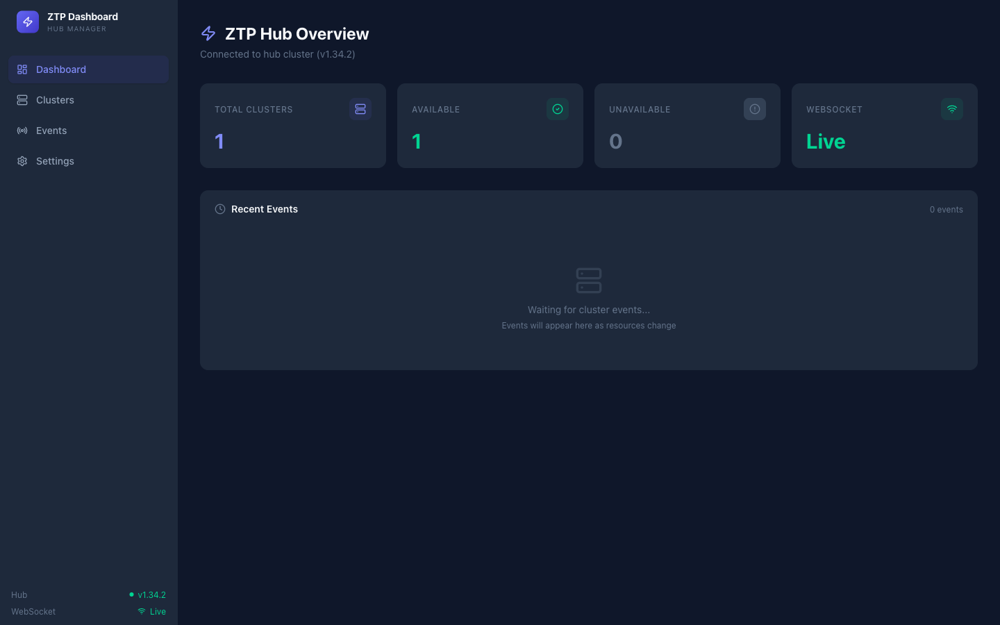

# ZTP Dashboard

A purpose-built dashboard for managing OpenShift Zero Touch Provisioning (ZTP) pipelines. Built as a single Go binary with an embedded React SPA, it provides real-time visibility into hub/spoke cluster provisioning, policy compliance, and AI-powered diagnostics via [ollama](https://ollama.com).



## Features

- **Real-time event stream** — WebSocket-driven live updates from 9 Kubernetes resource types
- **Pipeline visualization** — Visual provisioning pipeline with color-coded status indicators
- **Event classification** — Server-side severity analysis with contextual insights
- **AI diagnostics** — Stream ollama-powered analysis of cluster issues
- **Auto-AI mode** — Automatically analyze bad/warning events as they arrive
- **Policy compliance** — Track policy compliance status across managed clusters
- **Dark theme** — Custom dark UI with Tailwind CSS v4 design tokens

## Quick Start

```bash
# Build (frontend + backend → single binary)
make build

# Run against your hub cluster
./bin/ztp-dashboard serve --kubeconfig=~/.kube/config
```

Open `http://localhost:8080` in your browser.

## Guides

| Guide | Description |
|-------|-------------|
| [Architecture](docs/architecture.md) | System diagram, watched resources, event classification, AI diagnostics |
| [Configuration](docs/configuration.md) | CLI flags, environment variables, ollama setup, Docker |
| [API Reference](docs/api.md) | REST endpoints and WebSocket interface |
| [Development](docs/development.md) | Dev commands, project structure, screenshots |

## Development

```bash
make frontend-dev   # Frontend hot reload (port 5173, proxies to :8080)
make run            # Build and run Go binary
make test           # Run Go unit tests
make lint           # Run golangci-lint
make docker-build   # Build container image
```

## License

Apache License 2.0
