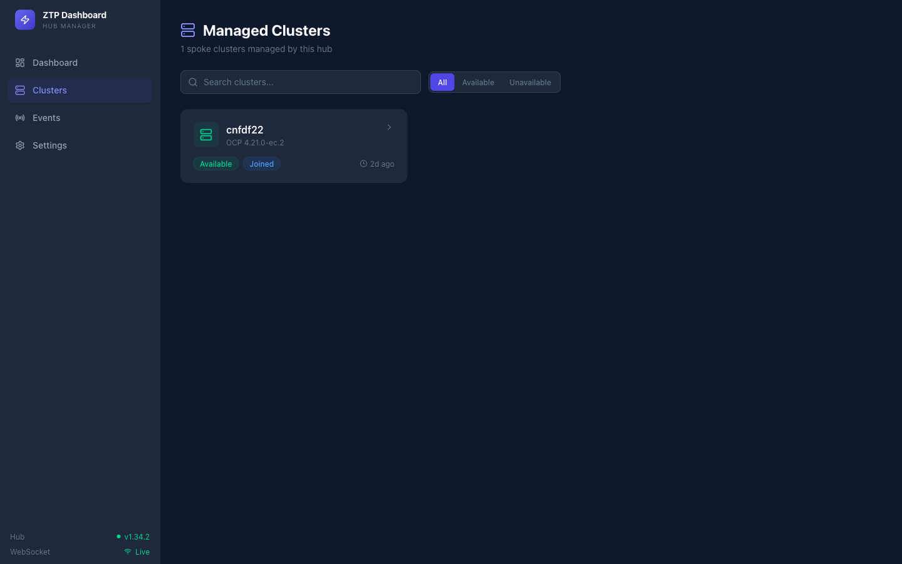
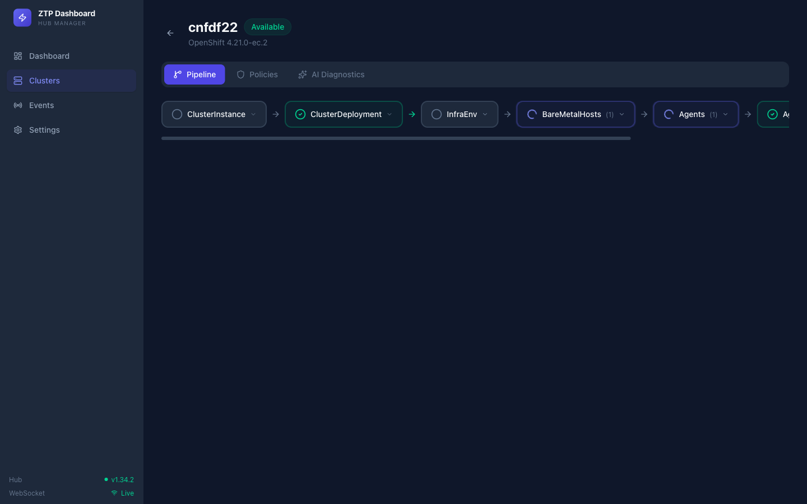
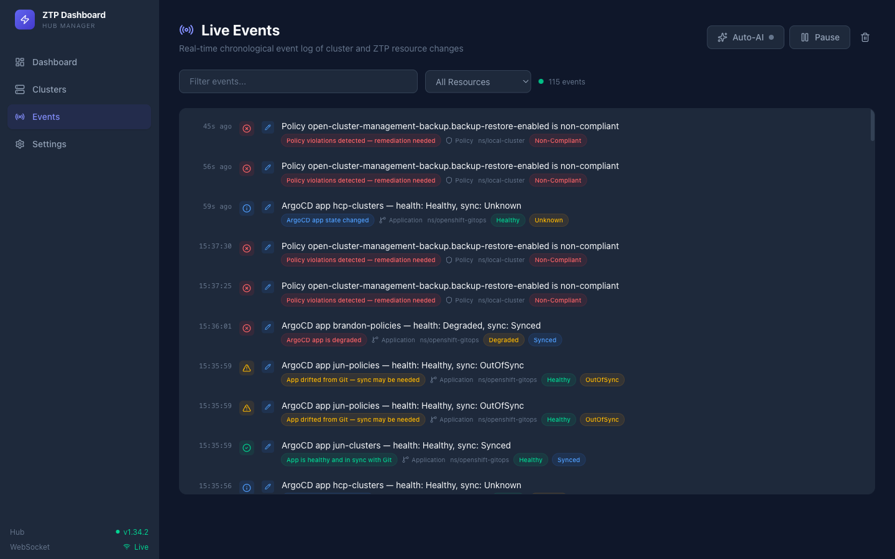
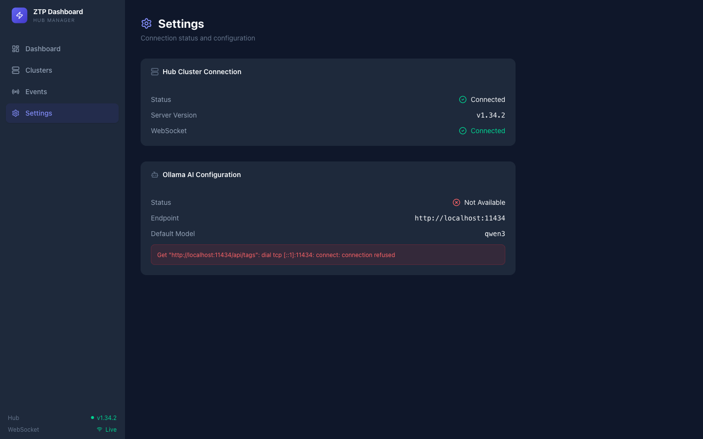

# Development

## Prerequisites

- Go 1.22+
- Node.js 20+
- Access to an OpenShift hub cluster with ACM (Advanced Cluster Management)
- (Optional) [ollama](https://ollama.com) running locally for AI diagnostics

## Commands

```bash
# Frontend dev server (hot reload, proxies API to :8080)
make frontend-dev

# Run Go backend
make run

# Run tests
make test

# Lint
make lint
```

## Project Structure

```
ztp-dashboard/
├── main.go                          # Entry point
├── cmd/                             # Cobra CLI commands
│   ├── root.go                      # Root command with flags
│   └── serve.go                     # Server bootstrap
├── internal/
│   ├── config/config.go             # Configuration
│   ├── k8s/
│   │   ├── client.go                # K8s client wrapper
│   │   └── gvr.go                   # GVR constants for ZTP CRDs
│   ├── hub/manager.go               # Hub operations + pipeline aggregation
│   ├── ai/
│   │   ├── client.go                # Ollama HTTP client
│   │   └── prompts.go               # ZTP-specific prompt templates
│   ├── api/
│   │   ├── server.go                # HTTP server + embedded SPA
│   │   ├── handlers.go              # REST + SSE handlers
│   │   ├── middleware.go            # CORS, logging, recovery
│   │   └── response.go             # JSON response helpers
│   └── ws/
│       ├── hub.go                   # WebSocket broadcast hub
│       ├── client.go                # WebSocket client
│       ├── types.go                 # Message types
│       └── watcher.go              # K8s watch → WebSocket bridge
├── frontend/
│   └── src/
│       ├── App.tsx                  # Routes
│       ├── types/api.ts             # TypeScript types
│       ├── lib/
│       │   ├── api.ts               # API client
│       │   └── store.ts             # Zustand store
│       ├── hooks/                   # useWebSocket, useHub, useAI
│       ├── components/              # EventFeed, PipelineVisualizer, etc.
│       └── pages/                   # Dashboard, Clusters, Events, Settings
├── Makefile
└── Dockerfile
```

## Screenshots

### Managed Clusters
Browse all spoke clusters with status badges, OCP version, and quick filters.



### Pipeline View
Visual ZTP provisioning pipeline for each spoke cluster — ClusterInstance, ClusterDeployment, InfraEnv, BareMetalHosts, Agents, AgentClusterInstall, and ManagedCluster stages.



### Live Events
Real-time chronological event log with severity indicators, insight badges, resource type filters, and per-event AI analysis.



### Settings
Hub connection status, ollama AI configuration, and model selection.


